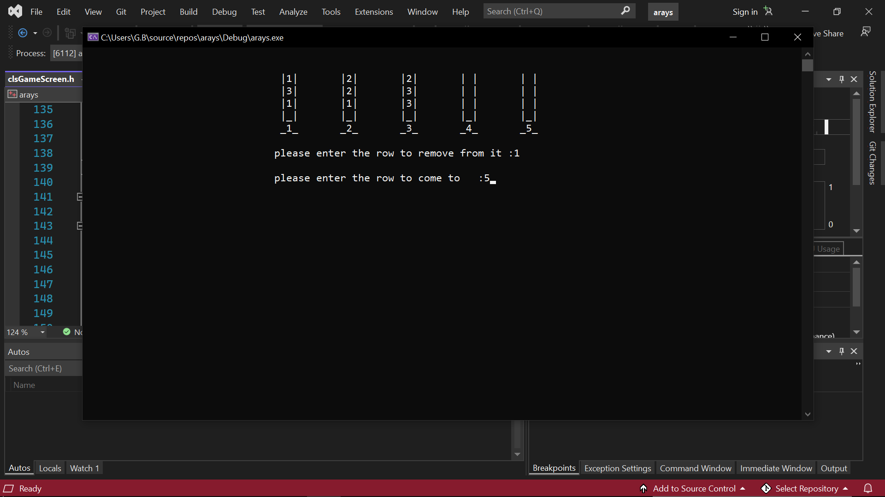
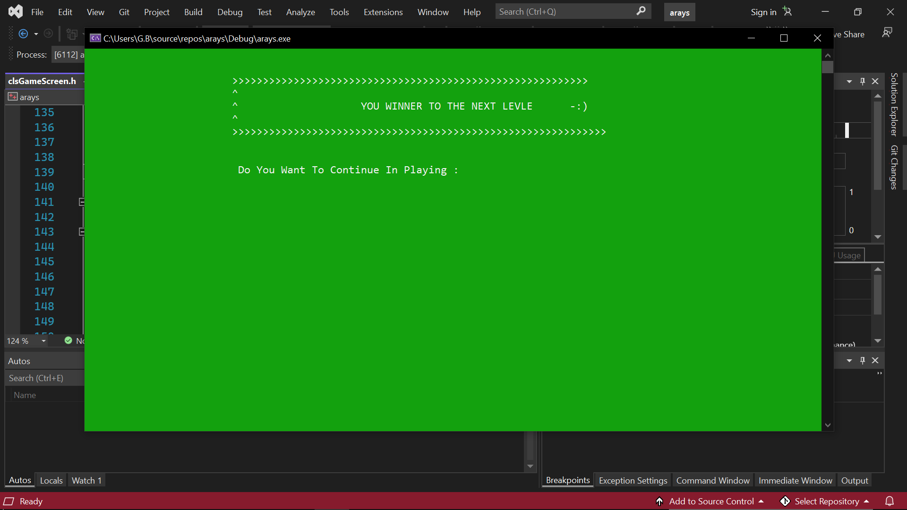

# 🎮 Column Sort Puzzle | لعبة تحدي ترتيب الأعمدة بلغة C++

**لعبة ذكاء ومنطق مبنية باستخدام C++ وتقنية الكونسول**، تم تصميمها لمحاكاة التحديات الذهنية المعقدة بأسلوب ممتع وتصاعدي!  
يُطلب من اللاعب ترتيب الأرقام داخل أعمدة متعددة بناءً على قواعد منطقية، مع ازدياد الصعوبة تدريجيًا في كل مرحلة.

---

## 🎯 فكرة اللعبة

في كل مرحلة، يتم عرض مجموعة من **الأعمدة** (Columns)، كل عمود يحتوي على **مجموعة من الأرقام العشوائية**.  
المطلوب من اللاعب:

1. اختيار العمود الذي يرغب في تحريك الأرقام منه.
2. اختيار العمود الذي يريد وضع الأرقام فيه.
3. التأكد من أن آخر رقم في العمود المستهدف يناسب الرقم المنقول (حسب شروط اللعبة).

كل ما أكملت المرحلة بنجاح 10 مرات متتالية → تنتقل إلى المرحلة التالية!  
في كل مرحلة جديدة:
- يزداد عدد الأعمدة.
- تزداد عدد الأرقام داخل الأعمدة.
- ترتفع درجة التحدي تدريجيًا.

---

## 🧠 أبرز الميزات

- 🧮 نظام تصاعدي في المستويات (Levels).
- 🔄 دعم تكرار نفس المرحلة حتى 10 مرات قبل الترقية.
- 🧩 منطق ترتيب يعتمد على ذكاء اللاعب وتحليله.
- 💾 تخزين جميع بيانات المراحل والمستويات في ملف نصي.
- 💬 واجهة تفاعلية بالكامل باستخدام Console I/O.
- 👨‍💻 مبني بالكامل باستخدام البرمجة الكائنية (OOP) بلغة C++.

---
## 📸 صور من داخل اللعبة

## ⚙️ طريقة التشغيل

1:افتح المشروع باستخدام محرر C++ مثل Code::Blocks أو Visual Studio أو VS Code.

2:تأكد من أن جميع ملفات .cpp و .h موجودة في نفس المجلد.

3:تأكد من وجود ملف Levels.txt في نفس مجلد التشغيل.

4:شغّل main.cpp.

5:سيتم عرض الأعمدة في الكونسول. أدخل رقم العمود الذي تريد التحريك منه، ثم رقم العمود الهدف.

6:كرّر العملية حسب قواعد اللعبة. إذا أكملت المرحلة بنجاح 10 مرات، سيتم نقلك تلقائيًا للمرحلة التالية.

## ⭐ دعم المشروع

إذا أعجبتك اللعبة أو استفدت منها، لا تنسَ دعم المشروع بالضغط على زر ⭐ في أعلى الصفحة.
هذا يشجعني على تقديم المزيد من المشاريع المفتوحة والمفيدة!

## 🧑‍💻 المطوّر

تم تطوير هذه اللعبة باستخدام C++ بهدف الدمج بين المنطق والبرمجة، وتقديم تجربة ذهنية ممتعة عبر واجهة الكونسول.
تم الاعتماد على المبادئ الكائنية (OOP) وتنظيم الأكواد بأسلوب يسهل التوسعة مستقبلاً.

لأي اقتراح أو تحسين، مرحبًا بمساهماتك عبر GitHub Issues أو Pull Requests
